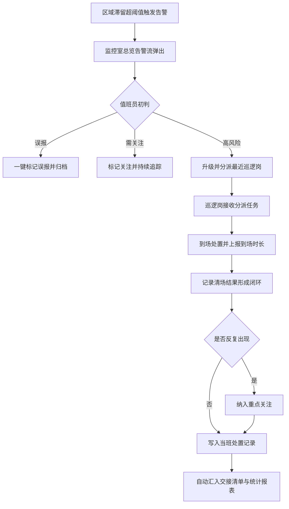
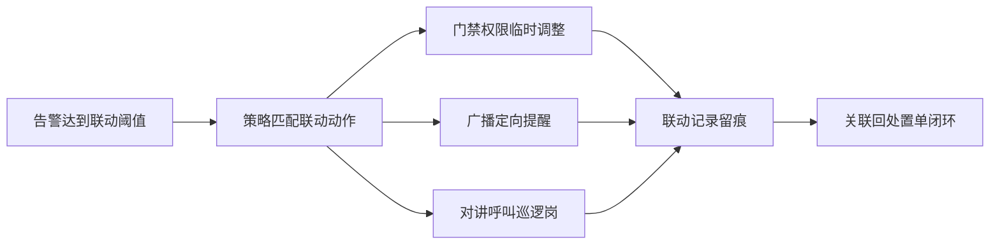
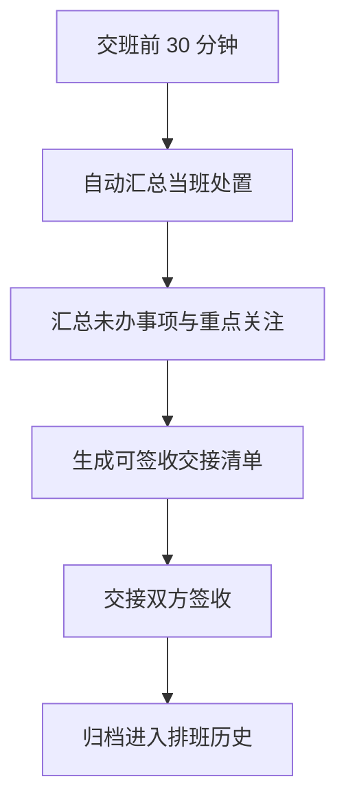

# 医院安保指挥中台 PRD

## 1. 产品概述

面向医院保卫处、监控室值班员与值班行政人员，对门诊大厅、急诊入口、ICU 外走廊、药房取药区、收费窗口、自助机区等重点区域的异常滞留进行实时告警、协同处置与复盘的 Web 指挥中台。系统通过按区域设定滞留时长阈值、区分候诊高峰与非正常停留，辅助安保人员在同屏完成视频画面、点位地图、告警队列的协同处置，并联动门禁、广播、对讲形成闭环，自动生成班次交接清单与处置效率报表，用于保卫例会复盘。

- 目标用户：医院保卫处主管、监控室值班员、巡逻岗、值班行政
- 解决问题：异常滞留发现晚、处置闭环难、排班交接信息断层、复盘缺数据
- 价值：缩短到场时长、提升清场率、沉淀可复盘的处置数据

## 2. 核心功能

### 2.1 用户角色

| 角色 | 使用场景 | 核心权限 |
|------|----------|------------------|
| 监控室值班员 | 实时盯屏、初判与分派 | 查看总览、处置告警、触发联动、生成交接清单 |
| 巡逻岗 | 接收分派、到场处置 | 查看分派任务、上报到场时长与清场结果 |
| 保卫处主管 | 策略制定与复盘 | 区域策略、排班值守、统计报表、重点关注 |
| 值班行政 | 交接与巡查 | 排班值守、交接清单、重点关注查看 |

### 2.2 功能模块（控制在 6 个模块内）

1. **实时总览**：全局态势感知，关键指标、区域状态网格、实时告警流、值班信息同屏
2. **告警处置**：告警队列 + 视频画面 + 点位地图三栏协同，一键标记误报/关注/升级，分派最近巡逻岗，记录处置人、到场时长、清场结果
3. **区域策略**：按区域设定滞留阈值，配置候诊高峰时段与夜间/节假日单独规则，区分患者候诊与非正常停留
4. **联动记录**：门禁、广播、对讲联动事件时间线，触发-执行-结果全链路留痕
5. **排班值守**：巡逻岗位置、班次排班、自动生成班次交接清单
6. **统计报表**：按院区/楼层/区域输出滞留热力与处置效率，重点关注反复人员/时段，用于保卫例会复盘

### 2.3 页面详情

| 页面名称 | 模块名称 | 功能描述 |
|-----------|-------------|---------------------|
| 实时总览 | 顶部态势栏 | 当前班次、在岗人数、未处置告警数、系统时间实时刷新 |
| 实时总览 | 关键指标卡 | 活跃告警、今日已处置、平均到场时长、清场率四项核心 KPI |
| 实时总览 | 区域状态网格 | 6 个重点区域卡片，显示当前滞留人数、最高滞留时长、状态色块，点击跳转告警处置 |
| 实时总览 | 实时告警流 | 按级别排序的滚动告警列表，支持快速标记误报 |
| 实时总览 | 值班信息条 | 当前班次、巡逻岗实时位置、交接倒计时 |
| 告警处置 | 告警队列 | 按级别/时间排序的告警列表，显示区域、滞留时长、级别标识 |
| 告警处置 | 视频画面 | 选中告警对应点位的模拟视频流，叠加滞留计时与区域标注 |
| 告警处置 | 点位地图 | 区域平面图，标注告警点位、巡逻岗位置、可达路径 |
| 告警处置 | 处置面板 | 一键标记误报/关注/升级；分派最近巡逻岗；记录处置人、到场时长、清场结果；显示重点关注提示 |
| 区域策略 | 区域列表 | 6 个重点区域树状列表，显示当前阈值与规则状态 |
| 区域策略 | 阈值与规则编辑 | 滞留时长阈值、候诊高峰时段、夜间/节假日规则、患者候诊判定参数 |
| 区域策略 | 规则预览 | 规则生效时间轴与预期触发示例 |
| 联动记录 | 联动事件时间线 | 按时间倒序的联动事件，支持门禁/广播/对讲类型筛选 |
| 联动记录 | 联动详情 | 触发告警来源、执行动作、结果反馈、关联处置单 |
| 排班值守 | 班次日历 | 月视图班次安排，白班/夜班/节假日颜色区分 |
| 排班值守 | 巡逻岗位置图 | 巡逻岗实时位置与责任区域，最近岗距离提示 |
| 排班值守 | 交接清单 | 自动汇总当班告警处置、未办事项、重点关注，生成可签收清单 |
| 统计报表 | 滞留热力图 | 按院区/楼层/区域的滞留频次热力，时段叠加 |
| 统计报表 | 处置效率分析 | 平均到场时长、清场率、误报率、升级率趋势 |
| 统计报表 | 重点关注分析 | 反复出现人员/时段排行与对比 |
| 统计报表 | 复盘报告 | 日报/周报卡片，用于保卫例会展示 |

## 3. 核心流程

### 3.1 告警处置主流程

监控室值班员在实时总览发现告警 → 进入告警处置同屏查看视频/地图/队列 → 一键标记（误报/关注/升级）或分派最近巡逻岗 → 巡逻岗到场处置并上报到场时长与清场结果 → 系统记录闭环并写入交接清单 → 反复人员/时段进入重点关注 → 进入统计报表复盘。

### 3.2 联动提醒流程

告警达到联动阈值 → 系统按区域策略触发门禁/广播/对讲 → 联动记录留痕 → 关联回处置单。

### 3.3 班次交接流程

交班前 30 分钟 → 系统自动汇总当班告警处置、未办事项、重点关注 → 生成交接清单 → 交接双方签收 → 归档进入排班值守历史。

## 4. 用户界面设计

### 4.1 设计风格

- **整体定位**：战术指挥中心（Tactical Operations Center）风格，深色基底 + 信号琥珀强调色，营造监控室夜间值守的专业与警觉氛围
- **主色**：深石板炭灰底（#0B0F14 / #11161E），信号琥珀强调（#F5B544），状态色采用高对比：危急红（#FF4D4F）、警告琥珀（#F5B544）、正常翠绿（#3DD68C）、信息青（#4FC3F7）
- **次级色**：冷调中性灰阶用于面板与分隔，避免大面积纯黑造成疲劳
- **字体**：数据/时间/ID 使用 IBM Plex Mono（等宽，工程感）；标题与正文使用 IBM Plex Sans（技术理性，区分常见无衬线）；中文搭配 Noto Sans SC
- **字号**：数据读数偏大且加粗，标签小而克制，形成强对比层级
- **按钮风格**：功能按钮采用紧凑矩形 + 细边框，关键动作（升级/分派）使用琥珀填充以引导视线，非破坏性动作使用线框
- **布局风格**：左侧固定导航栏 + 顶部态势条 + 信息密集内容区，命令中心式密度，重要状态常驻可见
- **图标风格**：lucide 线性图标，1.5px 描边，与文字基线对齐
- **动效**：告警进入有上推动画与级别高亮闪烁，数字变化采用滚动跳变，关键面板切换有轻微位移动效；克制使用，避免干扰盯屏

### 4.2 页面设计概览

| 页面名称 | 模块名称 | UI 元素 |
|-----------|-------------|-------------|
| 实时总览 | 顶部态势栏 | 紧凑横条，琥珀点缀当前班次，等宽数字显示系统时间，未处置数红色徽标 |
| 实时总览 | 关键指标卡 | 4 列卡片，大号等宽数字 + 小标签 + 环比箭头，卡片底部细进度条 |
| 实时总览 | 区域状态网格 | 2x3 网格区域卡，左上角状态色块，滞留人数与时长并排，超阈值时卡片边框琥珀呼吸 |
| 实时总览 | 实时告警流 | 单列滚动列表，每行级别色条 + 区域 + 时长 + 快捷动作按钮 |
| 告警处置 | 三栏布局 | 左告警队列、中视频+地图上下叠放、右处置面板，整体深色面板 + 细分隔 |
| 告警处置 | 视频画面 | 模拟视频帧 + 叠加 HUD（点位名、滞留计时、区域框选），琥珀十字准星标注 |
| 告警处置 | 点位地图 | SVG 区域平面图，告警点位琥珀脉冲圆点，巡逻岗青色三角，虚线可达路径 |
| 告警处置 | 处置面板 | 顶部告警摘要，三键标记区，分派卡片显示最近三岗距离，底部处置记录时间线 |
| 区域策略 | 阈值编辑 | 滑块 + 数值输入双控件，时段用横向时间条拖选，规则预览为时间轴 |
| 联动记录 | 时间线 | 左侧时间轴 + 右侧事件卡，类型用图标色块区分，详情展开抽屉 |
| 排班值守 | 班次日历 | 月历单元格内班次色块，右侧当日详情与巡逻岗列表 |
| 统计报表 | 热力图 | 区域矩阵热力，深浅映射频次，悬浮显示数值 |

### 4.3 响应式

- 桌面优先（1920x1080 / 2560 周界屏为目标），监控室大屏与值班台为主场景
- 中等屏（1280+）保持三栏与网格可用，告警处置可折叠地图
- 不针对移动端深度适配（巡逻岗使用为轻量只读视图）

### 4.4 3D 场景

本项目不涉及 3D 场景，点位地图采用 SVG 二维平面图实现，兼顾性能与清晰度。
