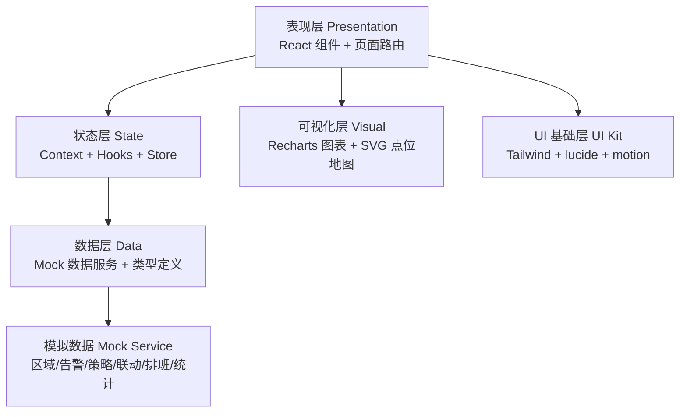
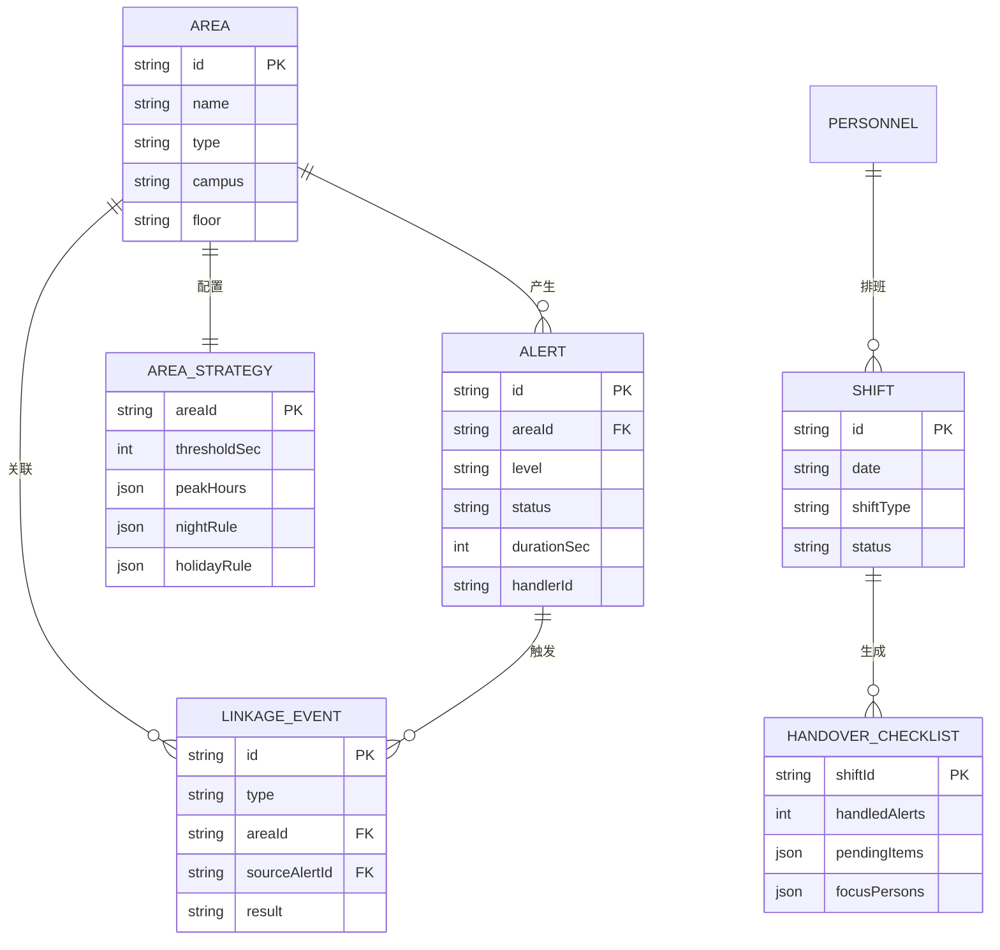

# 医院安保指挥中台 技术架构文档

## 1. 架构设计

本项目为纯前端单页应用，内置模拟数据驱动，聚焦指挥中台的交互与可视化。架构分为表现层、状态层、数据层三部分。



## 2. 技术说明

- **前端框架**：React@18 + TypeScript + Vite
- **样式方案**：Tailwind CSS@3（自定义主题 token 对应琥珀指挥色板）
- **路由**：react-router-dom@6
- **图表**：Recharts（折线、柱状、热力矩阵）
- **图标**：lucide-react
- **动效**：framer-motion（motion）用于告警进入、面板切换、数字跳变
- **状态管理**：React Context + 自定义 Hooks（告警队列、策略、排班上下文）
- **数据来源**：内置 Mock 数据服务（模拟实时告警推送、巡逻岗位置、处置闭环），无后端依赖
- **初始化工具**：vite-init（react-ts 模板）

## 3. 路由定义

| 路由 | 用途 |
|-------|---------|
| `/` | 实时总览：全局态势、关键指标、区域网格、实时告警流 |
| `/alerts` | 告警处置：告警队列 + 视频 + 点位地图 + 处置面板三栏 |
| `/strategy` | 区域策略：区域列表 + 阈值/高峰/夜间节假日规则编辑 |
| `/linkage` | 联动记录：门禁/广播/对讲事件时间线与详情 |
| `/shift` | 排班值守：班次日历 + 巡逻岗位置 + 交接清单 |
| `/reports` | 统计报表：滞留热力 + 处置效率 + 重点关注 + 复盘报告 |

## 4. API 定义

本项目无真实后端，采用 Mock 数据服务模拟接口。核心数据契约如下：

```typescript
// 区域
interface Area {
  id: string;
  name: string;
  type: '门诊大厅' | '急诊入口' | 'ICU外走廊' | '药房取药区' | '收费窗口' | '自助机区';
  campus: string;
  floor: string;
  cameraCount: number;
  currentLoitering: number;
  maxDurationSec: number;
  status: 'normal' | 'warning' | 'critical';
}

// 告警
type AlertLevel = 'low' | 'medium' | 'high' | 'critical';
type AlertStatus = 'pending' | 'dispatched' | 'handling' | 'closed' | 'falseAlarm' | 'watch';
interface Alert {
  id: string;
  areaId: string;
  areaName: string;
  level: AlertLevel;
  status: AlertStatus;
  durationSec: number;
  triggeredAt: string;
  handlerId?: string;
  handlerName?: string;
  arrivalSec?: number;
  clearanceResult?: 'cleared' | 'moved' | 'relocated' | 'unresolved';
  description: string;
  isRecurrent: boolean;
  mark?: 'false' | 'watch' | 'escalate';
}

// 策略
interface AreaStrategy {
  areaId: string;
  thresholdSec: number;
  peakHours: { start: string; end: string; patientWaitToleranceSec: number }[];
  nightRule: { enabled: boolean; thresholdSec: number; start: string; end: string };
  holidayRule: { enabled: boolean; thresholdSec: number };
  abnormalStayRule: { motionlessSec: number; revisitWithinMin: number; maxRevisitCount: number };
}

// 联动
type LinkageType = 'access' | 'broadcast' | 'intercom';
interface LinkageEvent {
  id: string;
  type: LinkageType;
  areaId: string;
  triggeredAt: string;
  sourceAlertId: string;
  action: string;
  result: 'success' | 'failed' | 'pending';
}

// 排班
interface Shift {
  id: string;
  date: string;
  shiftType: 'day' | 'night' | 'holiday';
  personnel: { id: string; name: string; role: string; post: string }[];
  status: 'planned' | 'active' | 'handedOver';
}

// 交接清单
interface HandoverChecklist {
  shiftId: string;
  generatedAt: string;
  handledAlerts: number;
  pendingItems: { id: string; area: string; desc: string }[];
  focusPersons: { name: string; count: number; areas: string[] }[];
  signedBy: string[];
}
```

## 5. 服务端架构

本项目无后端，不适用。所有数据由前端 Mock 服务在内存中生成与维护，模拟实时推送（setInterval 触发新告警与巡逻岗位置更新）。

## 6. 数据模型

### 6.1 数据模型定义



### 6.2 数据定义语言

本项目使用前端 Mock 数据，以下为初始模拟数据结构示例（位于 `src/data/mock.ts`）：

```typescript
// 6 个重点区域初始数据
export const areas: Area[] = [
  { id: 'A01', name: '门诊大厅', type: '门诊大厅', campus: '总院', floor: '1F', ... },
  { id: 'A02', name: '急诊入口', type: '急诊入口', campus: '总院', floor: '1F', ... },
  { id: 'A03', name: 'ICU外走廊', type: 'ICU外走廊', campus: '总院', floor: '3F', ... },
  { id: 'A04', name: '药房取药区', type: '药房取药区', campus: '总院', floor: '1F', ... },
  { id: 'A05', name: '收费窗口', type: '收费窗口', campus: '总院', floor: '1F', ... },
  { id: 'A06', name: '自助机区', type: '自助机区', campus: '总院', floor: '1F', ... },
];
```
